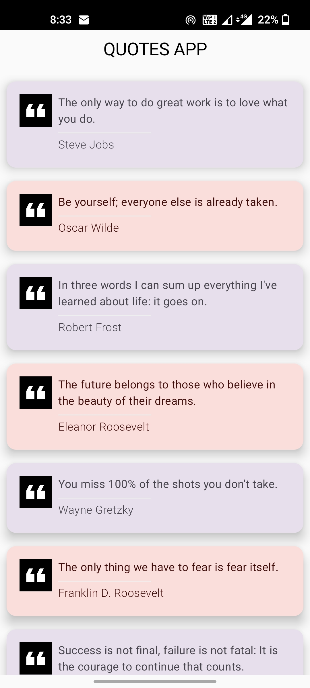
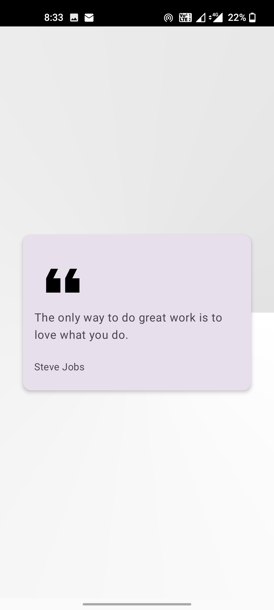

# Quotes-Jetpack-Compose

This is a simple Jetpack Compose application that displays famous quotes. It serves as a beginner-friendly project, providing an introduction to Jetpack Compose for newcomers.

## Features

- Displays a collection of famous quotes with their respective authors.
- Quotes are dynamically rendered using Jetpack Compose components.
- Provides a visually appealing user interface with smooth animations.

## Screenshots

## Technologies Used

- Jetpack Compose: A modern UI toolkit for building native Android apps using a declarative approach.
- Kotlin: The official programming language for Android app development.
- Android Studio: The integrated development environment (IDE) for Android development.

## License

MIT License

Copyright (c) 2023 Bhoomi Vaghasiya

Permission is hereby granted, free of charge, to any person obtaining a copy
of this software and associated documentation files (the "Software"), to deal
in the Software without restriction, including without limitation the rights
to use, copy, modify, merge, publish, distribute, sublicense, and/or sell
copies of the Software, and to permit persons to whom the Software is
furnished to do so, subject to the following conditions:

The above copyright notice and this permission notice shall be included in all
copies or substantial portions of the Software.

THE SOFTWARE IS PROVIDED "AS IS", WITHOUT WARRANTY OF ANY KIND, EXPRESS OR
IMPLIED, INCLUDING BUT NOT LIMITED TO THE WARRANTIES OF MERCHANTABILITY,
FITNESS FOR A PARTICULAR PURPOSE AND NONINFRINGEMENT. IN NO EVENT SHALL THE
AUTHORS OR COPYRIGHT HOLDERS BE LIABLE FOR ANY CLAIM, DAMAGES OR OTHER
LIABILITY, WHETHER IN AN ACTION OF CONTRACT, TORT OR OTHERWISE, ARISING FROM,
OUT OF OR IN CONNECTION WITH THE SOFTWARE OR THE USE OR OTHER DEALINGS IN THE
SOFTWARE.

## Author
Bhoomi Vaghasiya
